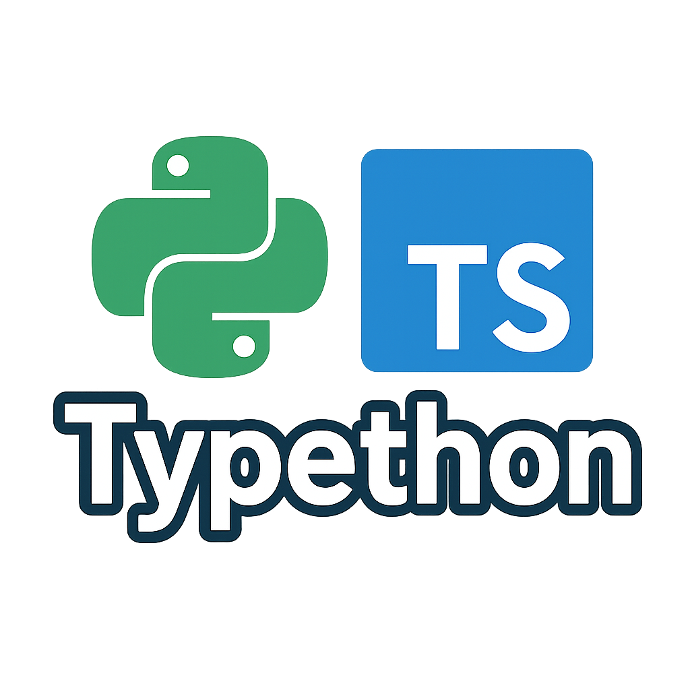

<p align="center">
   
   <div align="center">🚧 Work in progress 🚧</div>
</p>

Typethon is a Typescript pnpm monorepo with Turborepo containing a Python backend service and a Vite web application. Meant to provide a seamles developer experience for Typescript and Python devs. It's a minimal repository containing a Python backend, a Vite React app, and an autogenerated api-client that outputs a react-query client.


## Getting Started

### Prerequisites

- Node.js 22+
- pnpm 10+
- Python 3.9+ (for Python services)

### Installation & Setup

Install dependencies and set up the project:

```bash
pnpm install
pnpm setup-env
```

`setup-env` will ensure that you have python installed and setup the apps/core for you.

### Development

Start all services in development mode:

```bash
pnpm dev
```

## Available Commands

| Command          | Description                          |
| ---------------- | ------------------------------------ |
| `pnpm setup-env` | Set up Python environments           |
| `pnpm dev`       | Run all services in development mode |
| `pnpm build`     | Build all packages                   |
| `pnpm test`      | Run tests across all packages        |
| `pnpm typecheck` | Run type checking                    |
| `pnpm lint`      | Lint all packages                    |
| `pnpm format`    | Format code with Biome               |

## Monorepo Structure

```
typethon/
├── apps/                 # Application packages
│   ├── core/             # Core Python API service
│   └── web/              # Vite web application
├── packages/             # Shared packages (libraries, components, etc.)
│   └── api-client/       # Autogenerated TypeScript API client with React Query hooks
├── package.json          # Root package configuration
├── pnpm-workspace.yaml   # Workspace configuration
└── turbo.json            # Turborepo configuration
```

## Available Services

### Core API Service

The Core API service is a Python backend service using FastAPI with a layered architecture.

### Web Application

A modern Vite-powered web application that connects to the Core API.

### API Client

An autogenerated TypeScript client that provides type-safe access to the Core API endpoints with built-in React Query hooks. This package automatically synchronizes with the Python backend's API definitions.

## Python Environment

The Python environment is automatically set up through the `setup-env` script, which:

- Creates a `.venv` virtual environment in the core project
- Installs all dependencies from requirements.txt
- Sets up Python tools and configuration

### Required VS Code Extensions

For the best Python development experience in VS Code or Cursor, install these extensions:

- **Biome**: `biomejs.biome` - Official Biome extension for formatting and linting
- **Python**: `ms-python.python` - Main Python extension
- **Black Formatter**: `ms-python.black-formatter` - Code formatting
- **Flake8**: `ms-python.flake8` - Linting
- **Mypy Type Checker**: `ms-python.mypy-type-checker` - Type checking

### Select Python Interpreter

Once setup is complete, you'll need to select the Python interpreter:

1. Open a python file
2. Press `Cmd/Ctrl + Shift + P` → `Python: Select Interpreter`
3. Choose the `.venv/bin/python` in the core project folder

## Adding New Services

1. Create a new directory in the appropriate folder:

   - For applications: `apps/<service-name>`
   - For shared packages: `packages/<package-name>`

2. Add the service to the workspace by updating its package.json

3. Add the service to the Turborepo pipeline in `turbo.json` if needed
